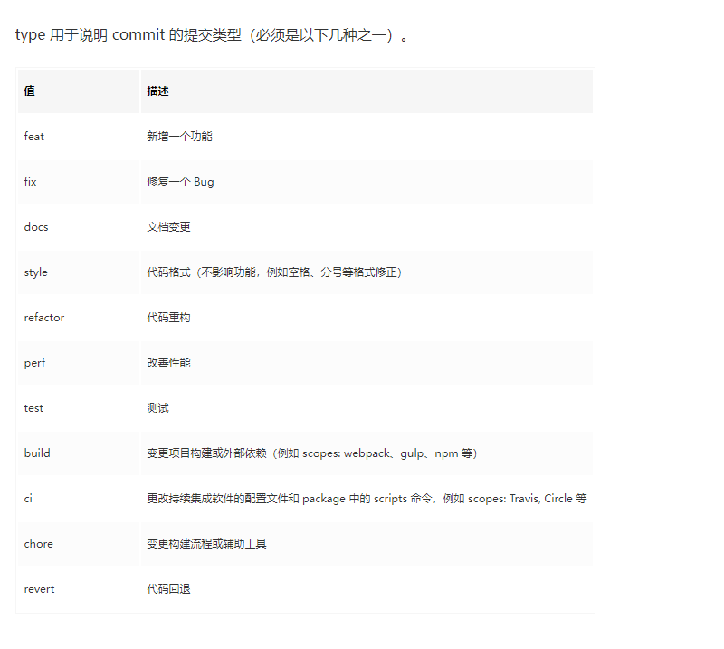

# Vue 3 + TypeScript + Vite

This template should help get you started developing with Vue 3 and TypeScript in Vite. The template uses Vue 3 `<script setup>` SFCs, check out the [script setup docs](https://v3.vuejs.org/api/sfc-script-setup.html#sfc-script-setup) to learn more.

## Recommended IDE Setup
### 代码规范效验配置
```
https://juejin.cn/post/7028021332713570318#heading-13
```

### 1、代码提交规范

```
// 列如：
// 新增一个功能
git commit -m "feat: xxx"
```

### 2、ts相关问题
1、如果在ts文件里面找不到文件别名 @ 路径对应的模块    
解决办法：   
> 在tsconfig.json里面的compilerOptions下加上baseUrl 和 path的配置
```
	"baseUrl": ".",
	"paths": {
		"@utils/*": ["src/utils/*"], // 根据ts配置项设置path属性可以自定义引入的路径
		"@router/*": ["src/router/*"]
	},
```
配置好以后，就可以在ts文件里面导入对应的文件夹下面的文件
```
import authUtils from '@utils/auth'
import router from '@router/index'
```
